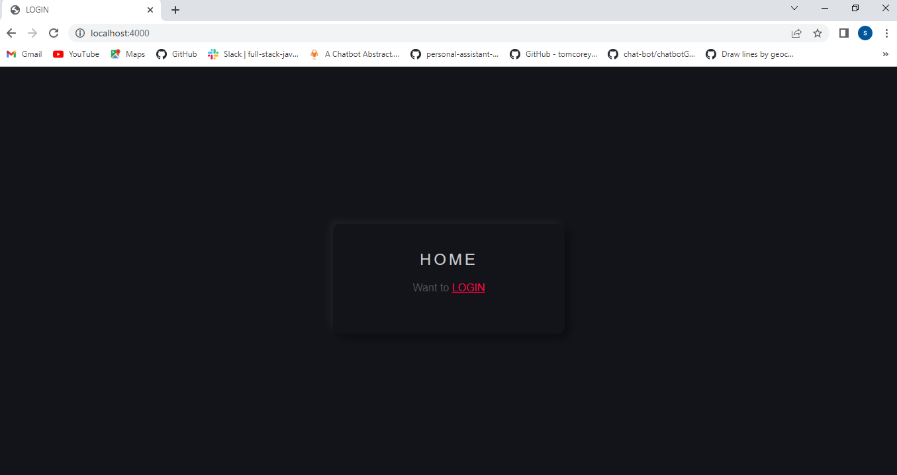
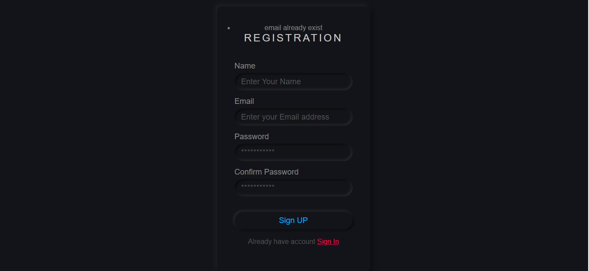
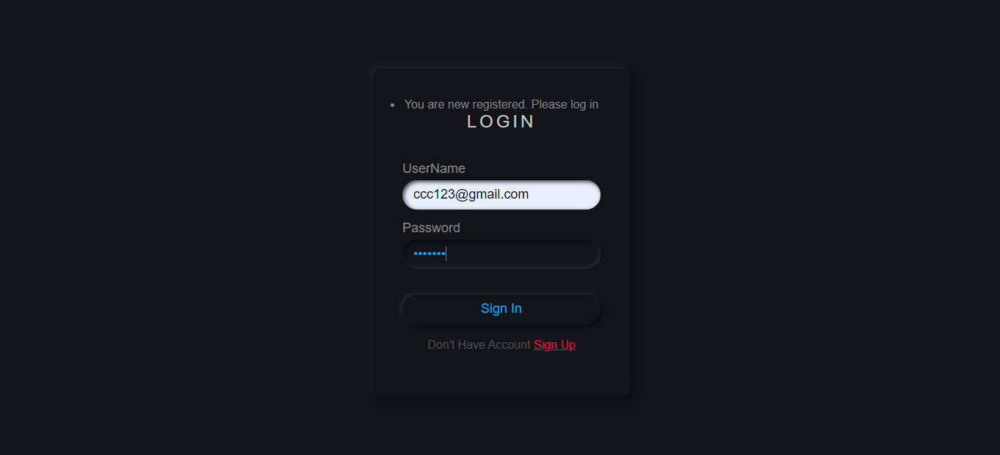
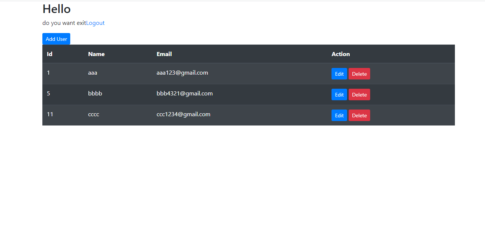
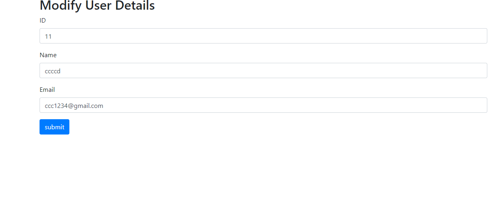
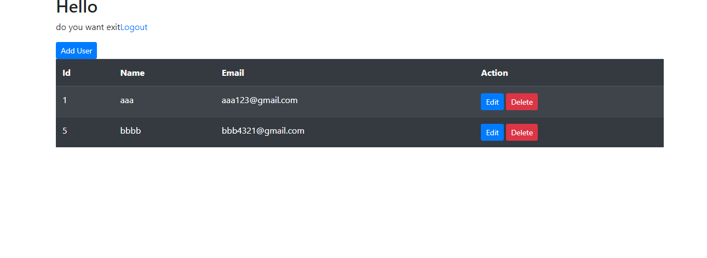

# User-Authentication using NodeJS
This project has user Authentication and CRUD function

Frontend: HTML,CSS,Express

Backend: PostgreSql, Nodejs

local host: 4000

# Database

Database Name: login
Datbase port: 5432
Databse host: local host
Database user: postgres
Database password: 1234

# HOME

# Register

# Login

# Dashboard

# Update

# delete

